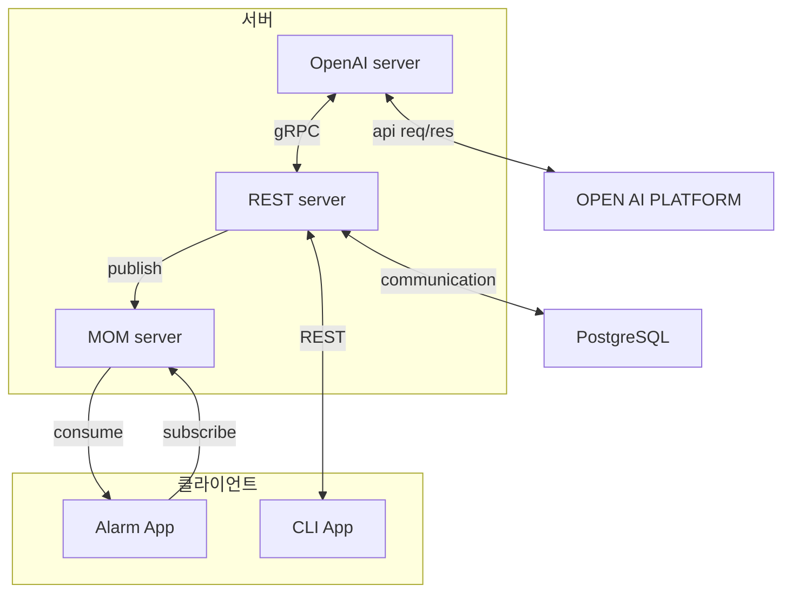

# AutoData Manager

### [프로젝트 설명 및 실습 영상](https://youtu.be/2WY0ZnQstG8)

<br>

## 소개

이 프로젝트는 데이터를 구조화하고 백업 및 이벤트 알림을 통해 안정적인 데이터 관리 시스템을 제공합니다. 또한 AI를 활용한 정규화와 크론 작업 관리로 기능을 자동화하며, MOM 시스템을 통해 확장 가능한 서비스 연동을 지원합니다.

<br>

## 주요 기능

- **Cron 작업 관리**: Cron 작업의 시작, 중지, 삭제, 조회를 지원.
- **데이터베이스 백업**: 특정 데이터베이스를 백업.
- **크론 백업 설정**: 주기적인 데이터베이스 백업을 위한 크론 작업 설정.
- **DDL 변경 감지**: PostgreSQL의 `listen/notify` 기능을 활용한 DDL 변경 감지 및 알림.
- **테이블 관리**:
  - 스키마 내 모든 테이블 조회.
  - 파일에서 테이블 생성.
  - 테이블 삭제 및 데이터 읽기.
  - 테이블 데이터를 파일로 내보내기.
- **AI 기반 정규화**: 파일 데이터를 기반으로 AI를 활용해 테이블 정규화.
- **알림 시스템**: MOM 서버를 통해 이벤트를 알림 애플리케이션으로 전달.

<br>

## 아키텍처

이 프로젝트는 클라이언트-서버 구조로 설계되었으며, 주요 아키텍처 구성 요소는 다음과 같습니다:

- **클라이언트**:

  - REST API를 사용하여 서버와 통신.

- **서버**:

  - PostgreSQL 데이터베이스와 GORM을 사용한 DAO 작업.
  - gRPC를 통해 Python 기반 OpenAI 서버 및 Go 기반 MOM 서버와 통합.

- **OpenAI 서버**:

  - AI를 활용한 테이블 정규화 처리.

- **MOM 서버**:

  - PostgreSQL의 `listen/notify` 기능으로 DDL 변경 이벤트를 구독하고 알림 애플리케이션에 전달.

- **AlarmApp 클라이언트**:

  - MOM 서버에서 특정 토픽의 데이터를 구독하고 처리.

<br>



<br>

## 사용 예시

1. **Cron 작업 관리**

   ```bash
   cron start
   cron stop
   cron jobs
   cron remove <jobId>
   ```

2. **데이터베이스 백업**

   ```bash
   backup my_database
   ```

3. **테이블 생성/읽기/삭제**

   ```bash
   create data.csv my_table csv
   delete my_table
   tables my_schema
   read my_table
   ```

4. **AI 기반 정규화**

   ```bash
   normalize data.csv csv
   ```

5. **DDL 변경 감지**

   ```bash
   listen
   unlisten
   ```

6. **테이블 내보내기**

   ```bash
   export my_table csv
   export my_table json
   ```

7. **AlarmApp 명령어**

   ```bash
   subscribe <topicName>
   ```

<br>

## 기술 스택

- **언어**: Go, Python
- **데이터베이스**: PostgreSQL
- **프레임워크 및 라이브러리**:
  - Go: GORM, Gin
  - Python: OpenAI API
- **통신 프로토콜**: REST API, gRPC
- **기타**: MOM 시스템, Cron
